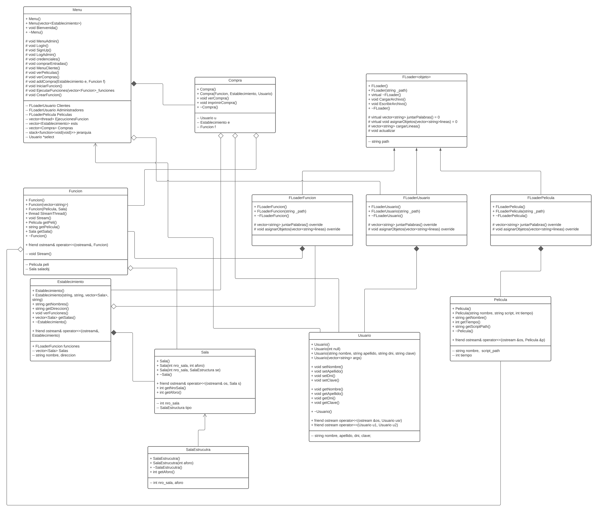

# Cinemania
Diseño e implementación de un sistema de cadena de cines.

# Miembros

**Morales Panitz, Alexander**

**Ugarte Quispe, Grover**

**Chumbe Ñahui, Herbert**

## Rúbrica
- [ ] Sin errores, acepta gran cantidad de información, manejo de errores, autonomía, interfaz y documentación adecuada.
- [ ] Abstracción de arquitectura, organización de paquetes, uso de estructuras STL, uso correcto del paradigma POO, Genérico, y Concurrente. Uso adecuado de librerías C++
- [ ] Optimziación y uso de algoritmos para las funcionalidades de la aplicación
- [ ] Se utiliza patrones de diseño (5 mínimo)
- [ ] Uso adecuado del Github

## Tasks

1. Grover:
    -> Autenticación
    -> Funciones
    -> Manejo concurrente

2. Alexander:
    -> Manejo de errores del sistema
    -> Algoritmo de encriptación de archivos.
    -> Generación de tokens para la realización de cada actividad del sistema
3. Herbert
    -> Diseño de clases
    
# Video
https://www.youtube.com/watch?v=jq363d1mziw

# Diagrama de clases y descripcion

## Clase Compra

-   Esta Clase se encarga de generar boletas para que el cliente pueda reservar su asistencia a la función del cine.
-   Las funciones *verCompra* e *imprimirCompra* permiten ver e imprimir a un txt la boleta respectivamente

## Clase template FLoader

-   Esta clase se encarga de utilizar el paradigma *Memento* para restaurar objetos con su último estado. 
-   Empleando *Template methods*, se especializan los algoritmos de carga del csv/ escritura al csv para cada clase que sea necesaria (*CargarArchivo* y *EscribirArchivo*)
-   *juntarPalabras* es un método abstracto que permite recuperar cadenas de texto de cada atributo de la clase en cuestión para generar una línea del CSV
-   *asignarObjetos* es un método abstracto que dependiendo de los parametros del objeto, realizará operaciones a las cadenas de teexto que extraiga del archivo CSV
-   Los objetos son almacenados en un vector *objetos* el cual puede ser accesado y modificado directamente

## Clase FLoaderPelicula, FLoaderUsuario, FLoaderFuncion

Son clases heredades y especializadas de FLoader que permite la carga de archivos a objetos de clase Pelicula, Usuario y Funcion. A su vez, permite la escritura de los objetos mencionados a sus respectivos CSV.

## Clase Pelicula

- Permite generar objetos con los datos de una pelicula: Nombre, duracion y un pseudoguion (con fines de ejecución de funciones de cine)
- Se le realizó una sobrecarga de salida estandar para permitir su salida efectiva hacia documentos

## Clase Usuario

- Esta clase contiene los datos de un usuario.
- Se le realizó una sobrecarga  de salida estandar para permitir su salida efectiva hacia documentos
- Se le realizó una sobrecarga de igualdad para lograr ubicar verificaciones con el CSV

## Clase Sala

-   Esta clase contiene los datos de una sala, como su identificación en el cine como su estructura de distribución y cantidad de asientos
-   Depende de la clase SalaEstructura
    Se le realizó una sobrecarga  de salida estandar para permitir su salida efectiva hacia documentos

## Clase SalaEstructura

- Son clases que sirven como base para la clase *Sala* ya que múltiples veces se reutilian planos para fabricar salas identicas
- Almacena aforo

## Clase Establecimiento

- Contiene los datos de un establecimiento, como su nombre, *salas* y *funciones* disponibles
- Para las funciones, emplea FLoadFuncion
- Se le realizó una sobrecarga  de salida estandar para permitir su salida efectiva hacia documentos

## Clase Funcion

- Contiene datos de funciones, por lo que depende de las clases Pelicula y Sala
- Presenta un método el cual emplea concurrencia para realizar la transmisión de múltiples funciones a la vez
- Se le realizó una sobrecarga  de salida estandar para permitir su salida efectiva hacia documentos

## Clase Menu

- Esta clase se encarga de realizar la manipulación de menus empleando *chain of responsibility* y un adaptador *stack* el cual decidirá siempre cual es el método más bajo en la jerarquía de funciones para poder ejecutar
- Como es una clase controladora del program, hace llamadas a todos sus recursos por medio de las herencias *FLoad*
- Permite al usuario realizar compras, imprimirlas
- Se encarga de separar el programa en dos menus diferentes, uno para Administradores y otrro para usuarios

## Namespace Utilidad

- Contiene funciones para la impresión total de archivos
- Contiene funciones para la impresión total de archivos y entrada estandar simúltaneamente
- Contiene funciones para asignar adecuadamente la función a tomar por el stack decididor de funciones

# Patrones empleados en cada clase

- Template Method - FLoader : Para cada especialización, hemos creado algoritmos para cargar y escribir archivos, los cuales variarán por objetos.
- Memento - FLoader : Floader y sus especializaciones permiten establecer a las instancias de Funcion, Pelicula y Usuario a su estado mas actual tomando los archivos CSV encontrados en /data.
- Chain of Responsibility - Menu : Empleando el namespace en Utilidad.cpp/.h, nos encargamos de que el stac tenga siempre las funciones de cada submenu, asemejandose a un estructura arbol
- Singleton - FLoader y sus derivaciones : En la Clase Menu y Establecimiento, solo es necesario una instancia de cada especialización de FLoadeer para proveer al resto de objetos con los datos de los CSV
- Builder - Compra : Hemos instanciado una clase compra que se encarga de poder especializar la creación de objetos por medio de sus objetos a crear.

# Fuentes Bibliograficas

-   Shvets, A. (2019). Dive Into Design Patterns (1st ed.). Refactoring.Guru.
-   Grimm, R. (2019). Concurrency with Modern C++ (1st ed.). Leanpub.
-   Vandevoorde, D., Gregor, D., & Josuttis, N. (2018). C++ templates (2nd ed.). Pearson Education Inc.
-   Wilf, H. (1994). Algorithms and Complexity. University of Pennsylvania. https://www2.math.upenn.edu/~wilf/AlgoComp.pdf
